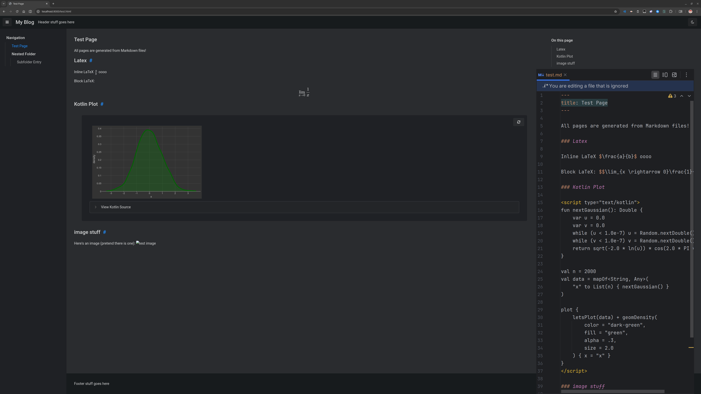

# DevBlog

This is something horrible I originally made in a single day. The tool is designed to run as cron with a synced source folder.



## Usage

1. Place Markdown files in `source/`
2. Run `python main.py`
3. Serve the files in `public/` using your preferred tool

## Features

### Drafts

You can mark files as drafts by including a header:
```markdown
---
# You can also set a custom title here, otherwise it will use the file name
title: My Title
draft: true
---
Incomplete stuff here
```

### Kotlin scripts

Aside from just JS, you can write Kotlin code. By default, lets-plot-kotlin has been provided.

```markdown
Some stuff here

<script type="text/kotlin">
// Sample snippet from the lets-plot-kotlin example notebook
fun nextGaussian(): Double {
    var u = 0.0
    var v = 0.0
    while (u < 1.0e-7) u = Random.nextDouble()
    while (v < 1.0e-7) v = Random.nextDouble()
    return sqrt(-2.0 * ln(u)) * cos(2.0 * PI * v)
}

val n = 200
val data = mapOf<String, Any>(
    "x" to List(n) { nextGaussian() }
)

plot {
    letsPlot(data) + geomDensity(
        color = "dark-green",
        fill = "green",
        alpha = .3,
        size = 2.0
    ) { x = "x" }
}
</script>
```

### LaTeX

Use `$ this $` for inline LaTeX, and `$$ this $$` for block LaTeX.

### Syntax Highlighting

The tool includes Pygments to highlight code snippets.

### Customizability

The entire thing* can be customized using the files in the `config/` folder.
You can also add additional files to be copied over from `config/` to `public/`.

*Pygments currently can only be set to predefined styles.

## Contributing

Here's stuff you can contribute:

- Community styles/layouts
- The default template files could use some improvements.
- Remove hardcoded stuff from generate.py where possible.
- The readme was written at 3:45 AM as should be pretty obvious.
- The way kotlinc-js and npx are invoked make the tool linux-only, windows support would be great.
- Support more metadata
  - OpenGraph tags
  - Last modified
  - Reading time
  - more?
